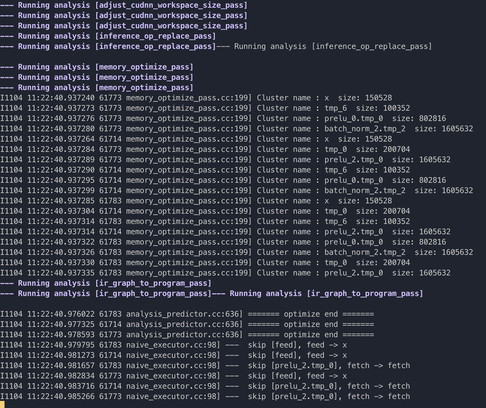

# 基于PaddleServing的服务部署

(简体中文|[English](./README.md))


本文档将介绍如何使用[PaddleServing](https://github.com/PaddlePaddle/Serving/blob/develop/README_CN.md)工具部署 Arcface 动态图模型的pipeline在线服务。

PaddleServing具备以下优点：
- 支持客户端和服务端之间高并发和高效通信
- 支持 工业级的服务能力 例如模型管理，在线加载，在线A/B测试等
- 支持 多种编程语言 开发客户端，例如C++, Python和Java

更多有关PaddleServing服务化部署框架介绍和使用教程参考[文档](https://github.com/PaddlePaddle/Serving/blob/develop/README_CN.md)。

## 目录
- [环境准备](#环境准备)
- [模型转换](#模型转换)
- [Paddle Serving pipeline部署](#部署)
- [FAQ](#FAQ)

<a name="环境准备"></a>
## 环境准备

需要准备 Arcface 的运行环境和Paddle Serving的运行环境。

- 准备 Arcface 的运行环境[链接](../../README.md)
  根据环境下载对应的paddle whl包，推荐安装2.2+版本

- 准备PaddleServing的运行环境，步骤如下

1. 安装serving，用于启动服务
    ```
    pip3 install paddle-serving-server==0.6.3 # for CPU
    pip3 install paddle-serving-server-gpu==0.6.3 # for GPU
    # 其他GPU环境需要确认环境再选择执行如下命令
    pip3 install paddle-serving-server-gpu==0.6.3.post101 # GPU with CUDA10.1 + TensorRT6
    pip3 install paddle-serving-server-gpu==0.6.3.post11 # GPU with CUDA11 + TensorRT7
    ```

2. 安装client，用于向服务发送请求
    ```
    pip3 install paddle_serving_client==0.6.3
    ```

3. 安装serving-app
    ```
    pip3 install paddle-serving-app==0.6.3
    ```

    **Note:** 如果要安装最新版本的PaddleServing参考[链接](https://github.com/PaddlePaddle/Serving/blob/develop/doc/LATEST_PACKAGES.md)。

<a name="模型转换"></a>
## 模型转换

使用PaddleServing做服务化部署时，需要将保存的inference模型转换为serving易于部署的模型。

首先，下载Arcface的inference模型
```
# 下载并解压 Arcface 模型
wget -nc -P ./inference https://paddle-model-ecology.bj.bcebos.com/model/insight-face/mobileface_v1.0_infer.tar
tar xf inference/mobileface_v1.0_infer.tar --strip-components 1 -C inference 
```

接下来，用安装的paddle_serving_client把下载的inference模型转换成易于server部署的模型格式。

```
python3 -m paddle_serving_client.convert --dirname ./inference/ \
                                         --model_filename inference.pdmodel \
                                         --params_filename inference.pdiparams \
                                         --serving_server ./MobileFaceNet_128_serving/ \
                                         --serving_client ./MobileFaceNet_128_client/
```

检测模型转换完成后，会在当前文件夹多出`MobileFaceNet_128_serving/` 和`MobileFaceNet_128_client`的文件夹，具备如下格式：
```
MobileFaceNet_128_serving
├── __model__
├── __params__
├── serving_server_conf.prototxt
└── serving_server_conf.stream.prototxt

MobileFaceNet_128_client/
├── serving_client_conf.prototxt
└── serving_client_conf.stream.prototxt

```

<a name="部署"></a>
## Paddle Serving pipeline部署

1. 下载insightface代码，若已下载可跳过此步骤
    ```
    git clone https://github.com/deepinsight/insightface

    # 进入到工作目录
    cd recognition/arcface_paddle/deploy/pdserving
    ```

    pdserving目录包含启动pipeline服务和发送预测请求的代码，包括：
    
    ```
    __init__.py
    config.yml            # 启动服务的配置文件
    pipeline_http_client.py   # web方式发送pipeline预测请求的脚本
    pipeline_rpc_client.py   # rpc方式发送pipeline预测请求的脚本
    web_service.py        # 启动pipeline服务端的脚本
    ```

2. 启动服务可运行如下命令：
    ```
    # 启动服务，运行日志保存在log.txt
    python3 web_service.py &>log.txt &
    ```
    成功启动服务后，log.txt中会打印类似如下日志
    

3. 发送服务请求：
    ```
    python3 pipeline_http_client.py
    ```
    成功运行后，模型预测的结果会打印在cmd窗口中，结果示例为：
    

    调整 config.yml 中的并发个数获得最大的QPS, 一般检测和识别的并发数为2：1
    ```
    ArcFace:
        #并发数，is_thread_op=True时，为线程并发；否则为进程并发
        concurrency: 8
        ...
    ```
    有需要的话可以同时发送多个服务请求

    预测性能数据会被自动写入 `PipelineServingLogs/pipeline.tracer` 文件中。

    在700张真实图片上测试，V100 GPU 上 QPS 均值可达到57左右：

    ```
    2021-11-04 13:38:52,507 Op(ArcFace):
    2021-11-04 13:38:52,507 	in[135.4579597902098 ms]
    2021-11-04 13:38:52,507 	prep[0.9921311188811189 ms]
    2021-11-04 13:38:52,507 	midp[3.9232132867132865 ms]
    2021-11-04 13:38:52,507 	postp[0.12166258741258741 ms]
    2021-11-04 13:38:52,507 	out[0.9898286713286714 ms]
    2021-11-04 13:38:52,508 	idle[0.9643989520087675]
    2021-11-04 13:38:52,508 DAGExecutor:
    2021-11-04 13:38:52,508 	Query count[573]
    2021-11-04 13:38:52,508 	QPS[57.3 q/s]
    2021-11-04 13:38:52,509 	Succ[0.9982547993019197]
    2021-11-04 13:38:52,509 	Error req[394]
    2021-11-04 13:38:52,509 	Latency:
    2021-11-04 13:38:52,509 		ave[11.52941186736475 ms]
    2021-11-04 13:38:52,509 		.50[11.492 ms]
    2021-11-04 13:38:52,509 		.60[11.658 ms]
    2021-11-04 13:38:52,509 		.70[11.95 ms]
    2021-11-04 13:38:52,509 		.80[12.251 ms]
    2021-11-04 13:38:52,509 		.90[12.736 ms]
    2021-11-04 13:38:52,509 		.95[13.21 ms]
    2021-11-04 13:38:52,509 		.99[13.987 ms]
    2021-11-04 13:38:52,510 Channel (server worker num[10]):
    2021-11-04 13:38:52,510 	chl0(In: ['@DAGExecutor'], Out: ['ArcFace']) size[0/0]
    2021-11-04 13:38:52,510 	chl1(In: ['ArcFace'], Out: ['@DAGExecutor']) size[0/0]
    ```

<a name="FAQ"></a>
## FAQ
**Q1**： 发送请求后没有结果返回或者提示输出解码报错

**A1**： 启动服务和发送请求时不要设置代理，可以在启动服务前和发送请求前关闭代理，关闭代理的命令是：
```
unset https_proxy
unset http_proxy
```
